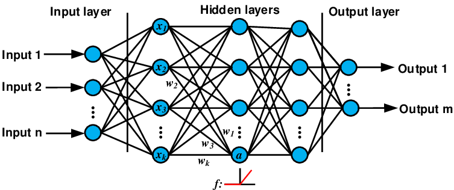

# Neural_Network
Supervised Machine Learning | Neural Network | Jupyter Notebook | Python | Scikit library

## Overview
This repo dives into Neural Networks, implementing a flexible, from-scratch version using Python, NumPy, Matplotlib, Sklearn and Pandas. The goal is to demystify how neural networks function by breaking down their core components—activation functions, gradient propagation, and parameter tuning—while benchmarking performance on real-world datasets.

#### Key Features
✔ From-Scratch Implementation: Builds a neural network without relying on high-level frameworks, covering:

  - Activation Functions (Softmax, ReLU) and their derivatives.

  - Forward & Backward Propagation (Gradient Descent, Loss Calculation).

  - Training Loop with adjustable hyperparameters (learning rate, epochs, hidden layers).

✔ Parameter Experimentation: Tests how different configurations (learning rates, network depth, activation functions) affect model performance.

✔ Real-World Datasets: Evaluated on the Iris, Wine, and Breast Cancer datasets to demonstrate robustness across classification tasks.

✔ Step-by-Step Explanation: The notebook provides clear, commented code and visualizations (e.g., loss curves, decision boundaries) to reinforce understanding.


## Table of Contents
- [File Structure 📂](#file-structure-📂)
- [Requirements 📦](#requirements-📦)
- [Installation Guide 🛠](#installation-guide-🛠)
- [Dataset Information 📊](#dataset-information-📊)
- [Neural Network Algorithm 🧠](#neural-network-algorithm-🧠)
- [Key Findings 📈](#key-findings-📈)
- [Contributing 🚀](#contributing-🚀)
- [Contact 📬](#contact-📬)


## File Structure 📂
The repo contains the following file structure:  

```bash
📦 Neural_Network repo
│-- 📜 Neural_Network.ipynb       # Jupyter Notebook with implementation
│-- 📜 requirements.txt         # List of dependencies
│-- 📜 iris.tmls                # Iris Flower dataset
│-- 📜 wine.data                # Wine dataset
|-- 📜 breast_cancer.csv                 # car dataset
│-- 📜 README.md                # Project documentation

```

## Requirements 📦
- **Python Version**: 3.10 or higher
- **External Dependencies**: Managed through `requirements.txt`
- **Jupter Notebook** for the web framework
- **Numpy** 
- **Panda** 

## Installation Guide 🛠

Follow the steps below to set up and run the project:

### 1️⃣ Clone the Repository
```bash
git clone https://github.com/adexoxo13/Naive-Bayes.git
cd Naive-Bayes
```

### 2️⃣ Create a Virtual Environment (Optional but Recommended)

```bash
conda create --name <my-env>
# When conda asks you to proceed, type y:
proceed ([y]/n)?  

#Verify that the new environment was installed correctly:
conda env list

#Activate the new environment:
conda activate myenv
```

### 3️⃣ Install Dependencies
```bash
pip install -r requirements.txt
```

### 4️⃣ Launch Jupyter Notebook
```bash
jupyter notebook
```
Open `Neural_Network.ipynb` in Jupyter and run the cells to see the model in action.

---

## Dataset Information 📊 
- The **Iris Dataset 🌸** consists of 150 samples, with the following attributes:

| Feature        | Description                    |
|----------------|--------------------------------|
| Sepal Length   | Length of the sepal (cm)       |
| Sepal Width    | Width of the sepal (cm)        |
| Petal Length   | Length of the petal (cm)       |
| Petal Width    | Width of the petal (cm)        |
| Species        | Type of Iris Flower (Target)   |
|----------------|--------------------------------|
---


- The **Wine Dataset 🍷** consists of 178 samples, with the following attributes:

| Feature                       | Description                                            |
|-------------------------------|--------------------------------------------------------|
| Alcohol                       | Acohol in the wine (percentage)                        |
| Malic Acid                    | Measure of acidity in the wine                         |
| Ash                           | Measure of ash content in the wine                     |
| Alcalinity of ash             | Measure of alkalinity in the wine                      |
| Magnesium                     | Measure of magnesium content in the wine               | 
| Total phenols                 | Measure of total phenolic compounds in the wine        |
| Flavanoids                    | Measure of flavonoid compounds in the wine             |
| Nonflavanoid Phenols          | Measure of nonflavanoid phenolic compounds in the wine |
| Proanthocyanins               | Measure of proanthocyanin compounds in the wine        | 
| Color intensity               | Measure of color depth and richness in the wine        |
| Hue                           | Measure of color tone and variation in the wine        |
| OD280/OD315 of diluted wines  | Measure of absorbance ratios in wines                  |
| Proline                       | Measure of amino acid content in the wine              |
| class                         | Type of wine ( The target)                             |
|-------------------------------|--------------------------------------------------------|

---

- The **Breast Cancer Wisconsin (Diagnostic) Dataset 🎗️** consists of 699 samples, with the following attributes

 

| Feature                       | Description                                                                 |
|-------------------------------|-----------------------------------------------------------------------------|
| Sample_code_number            | Unique patient sample ID (not used for training)                            |
| Clump_thickness               | Thickness of cell clumps (1-10)                                             |
| Uniformity_of_cell_size       | Consistency of cell size distribution (1-10)                                |
| Uniformity_of_cell_shape      | Consistency of cell shape distribution (1-10)                               |
| Marginal_adhesion             | Adhesion strength at tissue margins (1-10)                                  |
| Single_epithelial_cell_size   | Size of single epithelial cells (1-10)                                      |
| Bare_nuclei                   | Presence of bare nuclei (may indicate malignancy, 1-10)                     |
| Bland_chromatin               | Texture of chromatin in the nucleus (1-10)                                  |
| Normal_nucleoli               | Number of normal nucleoli (1-10)                                            |
| Mitoses                       | Rate of mitotic cell division (1-10)                                        |
| Class                         | Diagnosis label: **2 (Benign)** or **4 (Malignant)**                        |

---
## Neural Network Algorithm 🧠

A neural network is a supervised machine learning algorithm inspired by the human brain's structure. It learns complex patterns by adjusting its internal parameters through exposure to labeled training data.

#### Key Structural Components
1. Input Layer

    - Receives raw data (e.g., pixels, sensor readings, tabular features)

    - Number of neurons = number of input features

2. Hidden Layers

    - Intermediate processing layers that transform inputs

    - Each neuron connects to all neurons in previous/next layers (fully connected)

    - Depth (number of layers) and width (neurons per layer) determine model capacity

3. Output Layer

    - Produces final predictions (e.g., class probabilities, regression values)

    - Neuron count depends on task (1 for regression, N for N-class classification)

4. Weights & Biases

    - Numerical parameters that determine signal strength between neurons

    - Randomly initialized then optimized during training

#### How Neural Networks Learn

1. Forward Propagation

  - Data flows through the network layer by layer

  - Each neuron calculates:

    ```python
    output = activation_function( (inputs × weights) + bias )
    ```
2. Loss Calculation

  - Compares predictions against true labels using:

    - Cross-entropy (classification)

    - MSE (regression)

    - Or other task-specific metrics

3. Backpropagation

    - Calculates how much each weight contributed to the error

    - Uses calculus (chain rule) to determine weight adjustments

4. Optimization

  - Updates weights via gradient descent:
    ```python
      new_weight = old_weight - (learning_rate × gradient)
       ```
  - Repeats for many iterations (epochs)
<div>

</div>

#### What Makes Neural Networks Special
1. Universal Function Approximators

- Can theoretically learn any computable function given sufficient capacity

2. Automatic Feature Engineering

- Learns hierarchical representations:

    - Early layers detect simple patterns (edges, basic shapes)

    - Later layers combine them into complex concepts

3. Scalability

    - Performance typically improves with more data and larger models

    - Parallelizable computations enable training on massive datasets

4. Architecture Flexibility

* Adaptable to diverse data types through specialized variants:

    - CNNs for images (convolutional layers)

    - RNNs for sequences (recurrent connections)

    - Transformers for attention-based processing

5. State-of-the-Art Performance

* Dominates many domains when properly tuned:

    - Computer vision (image classification)

    - Natural language processing (translation)

    - Complex pattern recognition (speech, time series)
---
## Key Findings 📈 

### Neural Network Performance on Iris Dataset 🌸  
Mean Squared Error (MSE) across different hyperparameter combinations:

| Learning Rate | Layer Configuration (Neurons) | MSE       |
|---------------|-------------------------------|-----------|
| **1e-4**      | [32, 16]                      | 4151.83684|
| **1e-5**      | [32, 16]                      | 634.79464 |
| **1e-6**      | [32, 16]                      | 293.40159 |
| **1e-4**      | [16, 8, 4]                    | **0.55443** (Best) |
| **1e-5**      | [16, 8, 4]                    | 93.53034  |
| **1e-6**      | [16, 8, 4]                    | 476.73922 |
| **1e-4**      | [4, 16, 4]                    | 127.32822 |
| **1e-5**      | [4, 16, 4]                    | 460.94678 |
| **1e-6**      | [4, 16, 4]                    | 28.24677  |

---

#### **Insights** 🔍  
1. **Optimal Configuration**:  
   - Learning Rate = **1e-4** with Layers = **[16, 8, 4]** achieved the **lowest MSE (0.55)**.  
   - Deeper networks ([16, 8, 4]) outperformed shallower architectures ([32, 16] and [4, 16, 4]).

2. **Learning Rate Sensitivity**:  
   - Higher learning rates (1e-4) worked best for deeper networks but caused instability in simpler architectures (e.g., MSE = 4151 for [32, 16]).  
   - Lower learning rates (1e-6) stabilized training but required more epochs for convergence.

3. **Architecture Impact**:  
   - The **[4, 16, 4]** configuration showed inconsistent performance, suggesting bottlenecks in layer sizing.  

---

💡 **Recommendation**: For the Iris dataset, use **1e-4 learning rate** with **3 hidden layers ([16, 8, 4])** for optimal results.  
⚠️ **Note**: Extremely high MSE values (e.g., 4151) may indicate gradient explosion.
 

### Neural Network Performance on Wine Dataset 🍷  
Mean Squared Error (MSE) across different hyperparameter combinations:

| Learning Rate | Layer Configuration (Neurons) | MSE         |
|---------------|-------------------------------|-------------|
| **1e-4**      | [32, 16]                      | 2749.83885  |
| **1e-5**      | [32, 16]                      | 167.12074   |
| **1e-6**      | [32, 16]                      | 27061.16007 |
| **1e-4**      | [16, 8, 4]                    | 312.50391   |
| **1e-5**      | [16, 8, 4]                    | **5.83531** (Best) |
| **1e-6**      | [16, 8, 4]                    | 9.57499     |
| **1e-4**      | [4, 16, 4]                    | 719.63121   |
| **1e-5**      | [4, 16, 4]                    | 6.77906     |
| **1e-6**      | [4, 16, 4]                    | 4442.91007  |

---

#### **Insights** 🔍  
1. **Optimal Configuration**:  
   - Learning Rate = **1e-5** with Layers = **[16, 8, 4]** achieved the **lowest MSE (5.84)**.  
   - Balanced architectures ([16, 8, 4]) outperformed both wider ([32, 16]) and imbalanced ([4, 16, 4]) designs.

2. **Critical Learning Rate Impact**:  
   - Extremely low learning rates (1e-6) caused instability in simpler architectures (e.g., MSE = 27,061 for [32, 16]).  
   - Moderate learning rates (1e-5) stabilized training across most configurations.

3. **Layer Sensitivity**:  
   - The **[4, 16, 4]** configuration showed erratic results, suggesting unstable gradient flow in asymmetric architectures.  
   - Deeper networks ([16, 8, 4]) maintained consistent performance across learning rates.

---

💡 **Recommendation**: For the Wine dataset, use **1e-5 learning rate** with **3 balanced hidden layers ([16, 8, 4])**.  
⚠️ **Critical Notes**:  
- For configurations with MSE > 1000 implicate a potential gradient issues.  
- Avoid extremely low learning rates (1e-6) for shallow networks.  
- Consider gradient clipping for unstable architectures.

---
### Neural Network Performance for Breast Cancer Wisconsin (Diagnostic) Dataset 🎗️  
Mean Squared Error (MSE) across different hyperparameter combinations:

| Learning Rate | Layer Configuration (Neurons) | MSE       |
|---------------|-------------------------------|-----------|
| **1e-4**      | [32, 16]                      | 1.81259   |
| **1e-5**      | [32, 16]                      | 53.44679  |
| **1e-6**      | [32, 16]                      | 365.54823 |
| **1e-4**      | [16, 8, 4]                    | 1.71724   |
| **1e-5**      | [16, 8, 4]                    | 4.23678   |
| **1e-6**      | [16, 8, 4]                    | 43.25898  |
| **1e-4**      | [4, 16, 4]                    | 5.33441   |
| **1e-5**      | [4, 16, 4]                    | **1.07188** (Best) |
| **1e-6**      | [4, 16, 4]                    | 91.15968  |

---

#### **Insights** 🔍  
1. **Top Performers**:  
   - **Best Result**: Learning Rate = **1e-5** with Layers = **[4, 16, 4]** achieved the **lowest MSE (1.07)**.  
   - **Runner-Up**: Learning Rate = **1e-4** with **[16, 8, 4]** layers also performed strongly (MSE = 1.72).  

2. **Learning Rate Dynamics**:  
   - Higher learning rates (1e-4) worked well for both **[32, 16]** and **[16, 8, 4]** architectures.  
   - Very low rates (1e-6) caused poor convergence across all configurations (MSE > 40).  

3. **Architecture Observations**:  
   - The asymmetric **[4, 16, 4]** structure outperformed deeper networks at 1e-5, suggesting feature compression benefits.  
   - Wider layers ([32, 16]) struggled with low learning rates but delivered usable results at 1e-4.  

---

💡 **Recommendation**:  
- **Primary Choice**: Use **1e-5 learning rate** with **[4, 16,  ][4]** layers for optimal performance.  
- **Alternative**: For stable mid-range results, pair **1e-4 learning rate** with **[16, 8, 4]** layers.  

⚠️ **Critical Notes**:  
- Investigate potential overfitting in the best model (extremely low MSE).  
- Avoid 1e-6 learning rates entirely for this dataset.  


---
## Contributing 🚀

Contributions are welcome! Feel free to fork the repository and submit a pull request. 

---

### Dataset Citation
The datasets used in this project are from the [UCI Machine Learning Repository](https://archive.ics.uci.edu):  
**Dua, D. and Graff, C.** (2019). *UCI Machine Learning Repository*. Irvine, CA: University of California, School of Information and Computer Science.  

---
## Contact 📬

Feel free to reach out or connect with me:

- 📧 **Email:** [adenabrehama@gmail.com](mailto:adenabrehama@gmail.com)
- 💼 **LinkedIn:** [linkedin.com/in/aden](https://www.linkedin.com/in/aden-alemayehu-1629aa255)
- 🎨 **CodePen:** [codepen.io/adexoxo](https://codepen.io/adexoxo)

📌 *Star this repository if you found it useful!* ⭐


